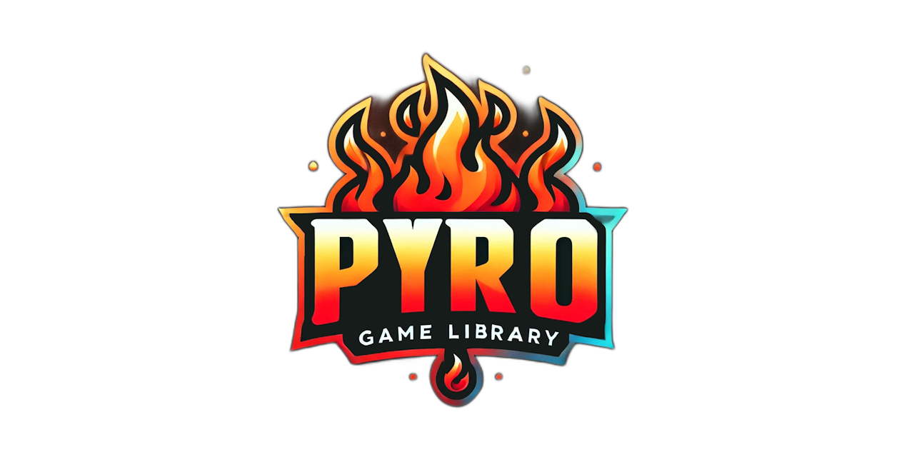

  

The **🔥 Pyro Game Library (PGL)** is an advanced 2D game development toolkit for [Delphi](https://www.embarcadero.com/products/delphi), designed to make building games fast, reliable, and powerful. Say goodbye to runtime DLLs—PGL embeds all external dependencies directly into your executable and loads them **entirely in memory**, never saving them to disk. This innovative approach simplifies deployment 📦, enhances security 🔒, boosts performance 🚀, and eliminates compatibility issues, ensuring your games are stable and ready to shine.

Optimized for modern Windows platforms, PGL fully supports **Win64** and **Unicode**, making it perfect for projects targeting **Windows 10** and **11**. Leveraging the latest development technologies, PGL delivers a streamlined workflow with robust features like **memory-efficient IO operations**, **high-performance rendering** for graphics and video 🎨, and **immersive audio playback** 🎵. The direct memory loading design reduces I/O overhead, providing a smooth, optimized experience for your players. 🎮

With its all-in-one solution, PGL removes the complexity of managing multiple libraries or external dependencies, letting you focus on creating outstanding games. Whether you're crafting your first indie project or a professional-grade title, PGL equips you with everything you need to bring your vision to life.

✨ Ready to get started? Download the latest version from GitHub and start building today! 🔥 Let Pyro Game Library help you deliver secure, high-performance, and unforgettable gaming experiences your players will love. 💪🎉

---

The **Pyro Game Library (PGL)** is a **work-in-progress**, and we’re actively developing and improving it to bring you the best 2D game development experience! 🚀 The repository’s README is currently under construction 🛠️, but we’re here to help if you need assistance.  

Feel free to:  
- 💬 [**Join our Discord**](https://discord.gg/tPWjMwK) for live discussions and support.  
- 📝 [**Post in Discussions**](https://github.com/tinyBigGAMES/Pyro/discussions) for questions or suggestions.  
- 🐞 [**Submit an Issue**](https://github.com/tinyBigGAMES/Pyro/issues) if you encounter any bugs or need help with specific problems.  

We appreciate your patience and feedback as we continue to build something awesome together! 🎮🔥